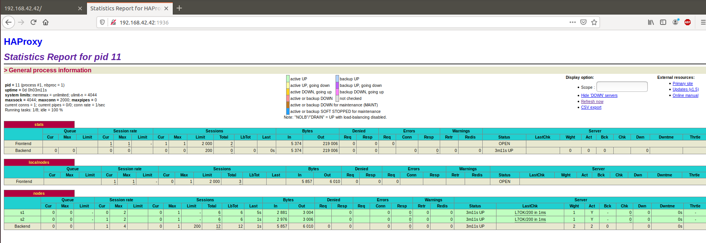

# Lab 04 - Docker

Auteurs : Polier Florian, Tran Eric     
Date : 04.12.2019
Repo : https://github.com/ercclpn/Teaching-HEIGVD-AIT-2019-Labo-Docker

# Introduction

Grâce à ce laboratoire, nous avons pu nous familiariser avec docker et avec la construction d'une architecture dynamique. 
Nous avons pu effectuer cela notamment grâce à Serf, Docker-compose, HAProxy, nodejs etc. Ces technologies ont amélioré notre compréhension générale
sur Docker et son fonctionnement interne, ainsi que sur la haute disponibilité avec la scalability en largeur (ajout et suppression de noeuds à la volée). 

# Task 0


1. <a name="M1"></a>**[M1]** Do you think we can use the current
   solution for a production environment? What are the main problems
   when deploying it in a production environment?

    Non l'environnement actuel ne répond pas à l'évolutivité et non résilient à la panne car il n'y a que 1 seul load-balancer qui est le noeud critique de l'environnement. De plus, il n'est pour l'instant pas possible de facilement ajouter ou enlever un noeud au pool d'application.

2. <a name="M2"></a>**[M2]** Describe what you need to do to add new
   `webapp` container to the infrastructure. Give the exact steps of
   what you have to do without modifiying the way the things are
   done. Hint: You probably have to modify some configuration and
   script files in a Docker image.
   
   Pour ajouter un nouveau noeud en l'état actuel, il faut : 
- Ajouter dans le docker-compose.yml 
```
  webapp3:
       container_name: ${WEBAPP_3_NAME}
       build:
         context: ./webapp
         dockerfile: Dockerfile
       networks:
         heig:
           ipv4_address: ${WEBAPP_3_IP}
       ports:
         - "4002:3000"
       environment:
            - TAG=${WEBAPP_3_NAME}
            - SERVER_IP=${WEBAPP_3_IP}
 - Redéfinir les variables globales pour qu'elles correspondent dans .env
WEBAPP_3_NAME=s3
WEBAPP_3_IP=192.168.42.33
```

- Ajouter dans le ficher de conf haproxy.cfg :
 server s3 ${WEBAPP_3_IP}:3000 check

- Ajouter dans le fichier de conf run.sh dans ha/scripts
sed -i 's/<s3>/$S3_PORT_3000_TCP_ADDR/g' /usr/local/etc/haproxy/haproxy.cfg

   Pour ajouter un nouveau noeud en l'état actuel, il faut : 
    - Ajouter dans le docker-compose.yml 
  
    ```docker
    webapp3:
        container_name: ${WEBAPP_3_NAME}
        build:
            context: ./webapp
            dockerfile: Dockerfile
        networks:
            heig:
            ipv4_address: ${WEBAPP_3_IP}
        ports:
            - "4002:3000"
        environment:
                - TAG=${WEBAPP_3_NAME}
                - SERVER_IP=${WEBAPP_3_IP}
    ```

 - Redéfinir les variables globales pour qu'elles correspondent dans .env

    ```bash
    WEBAPP_3_NAME=s3
    WEBAPP_3_IP=192.168.42.33
    ```
- Ajouter dans le ficher de conf haproxy.cfg :
```bash
 server s3 ${WEBAPP_3_IP}:3000 check
```


3. <a name="M3"></a>**[M3]** Based on your previous answers, you have
   detected some issues in the current solution. Now propose a better
   approach at a high level.
   
   Réponse : La solution est décrite dans la réponse à la question suivante.

4. <a name="M4"></a>**[M4]** You probably noticed that the list of web
    application nodes is hardcoded in the load balancer
    configuration. How can we manage the web app nodes in a more dynamic
    fashion?

    Réponse : Pour cela nous pouvons utiliser des moteurs de templates pour générer des configurations dynamiques, des scripts qui géreront l'entrée
    et la sortie de noeud dans l'infrastructure et surtout Serf, un outil peer-to-peer qui s'occupera d'auto-manager le cluster de noeud (c'est à dire l'ensemble des serveurs web derrière le reverse proxy).

5. <a name="M5"></a>**[M5]** In the physical or virtual machines of a
   typical infrastructure we tend to have not only one main process
   (like the web server or the load balancer) running, but a few
   additional processes on the side to perform management tasks.

   For example to monitor the distributed system as a whole it is
   common to collect in one centralized place all the logs produced by
   the different machines. Therefore we need a process running on each
   machine that will forward the logs to the central place. (We could
   also imagine a central tool that reaches out to each machine to
   gather the logs. That's a push vs. pull problem.) It is quite
   common to see a push mechanism used for this kind of task.

   Do you think our current solution is able to run additional
   management processes beside the main web server / load balancer
   process in a container? If no, what is missing / required to reach
   the goal? If yes, how to proceed to run for example a log
   forwarding process?

   Réponse : Non, actuellement seul les processus de nodejs et du reverse proxy tournent sur les docker. 
   Par conséquent, seul des informations basiques sont échangées (test si le serveur est UP par exemple)
   Une solution serait par exemple d'ajouter dans notre infrastructure une image Docker servant de serveur Syslog, et de configurer nos autres images pour lui envoyer tous les logs (push solution), de plus avoir une image à part permet de respecter au mieux la philosophie docker "One main process per container"

6. <a name="M6"></a>**[M6]** In our current solution, although the
   load balancer configuration is changing dynamically, it doesn't
   follow dynamically the configuration of our distributed system when
   web servers are added or removed. If we take a closer look at the
   `run.sh` script, we see two calls to `sed` which will replace two
   lines in the `haproxy.cfg` configuration file just before we start
   `haproxy`. You clearly see that the configuration file has two
   lines and the script will replace these two lines.

   What happens if we add more web server nodes? Do you think it is
   really dynamic? It's far away from being a dynamic
   configuration. Can you propose a solution to solve this?

   Réponse : Effectivement, c'est loin d'être dynamique. À chaque changement (ajout ou suppression de noeud) il faut recharger la configuration
   (redémarrer le container après avoir soi-même modifié le script `run.sh`)
   Une meilleure solution sera celle proposée au long de ce laboratoire, qui consiste à "surveiller" l'arrivée et le départ de nouveau noeud backend afin de les incorporer dynamiquement à la configuration à l'aide de différents outils, templates et scripts.
   PS : le script en l'état n'a aucun effet


   
**Deliverables**:

1. Take a screenshot of the stats page of HAProxy at
   <http://192.168.42.42:1936>. You should see your backend nodes.

   

2. Give the URL of your repository URL in the lab report.

Repo : https://github.com/ercclpn/Teaching-HEIGVD-AIT-2019-Labo-Docker


# Task 1


1. Take a screenshot of the stats page of HAProxy at http://192.168.42.42:1936. You should see your backend nodes. It should be really similar to the screenshot of the previous task.


2. Describe your difficulties for this task and your understanding of what is happening during this task. Explain in your own words why are we installing a process supervisor. Do not hesitate to do more research and to find more articles on that topic to illustrate the problem.

Réponse : Pas de difficulté particulière à cette étape, nous avions déjà pas mal côtoyé docker et sa philosophie en cours de RES. Toutefois nous ne connaissions pas S6 et nous comprenons mieux leur avis sur la philosophie docker "un container une tâche".


# Task 2

1. Provide the docker log output for each of the containers: ha, s1 and s2. You need to create a folder logs in your repository to store the files separately from the lab report. For each lab task create a folder and name it using the task number. No need to create a folder when there are no logs.

Réponse : tout est dans le dossier `logs`

2. Give the answer to the question about the existing problem with the current solution.

Réponse : Outre le fait que les scripts n'existent pas encore, la seule missconception que j'ai trouvée c'est le fait que le proxy réagit à sa propre entrée dans le cluster alors qu'il ne devrait pas car ce n'est pas un noeud nodejs.

3. Give an explanation on how Serf is working. Read the official website to get more details about the GOSSIP protocol used in Serf. Try to find other solutions that can be used to solve similar situations where we need some auto-discovery mechanism.

Réponse : Serf fonctionne à l'aide du principe de cluster. Lorsqu'un cluster est créé, plusieurs noeuds peuvent le rejoindre. La communication à l'intérieur de ce cluster se faire purement en P2P et cela grâce à plusieurs mécanismes :

- Le "Gossip" (bavardage) consiste à des messages informant de changement d'état par UDP qui sont envoyés périodiquement

- Full sync (TCP) : Plus rarement que le gossip, 2 noeuds vont synchroniser leur état complet afin de faire "converger" plus rapidement l'état du cluster

- Failure detection : Afin de détecter un noeud DOWN, on envoie une probe à un noeud aléatoire. Si celui-ci ne répond pas, il devient "suspect" et après plusieurs échecs, il est considéré comme mort

Une alternative viable à Serf serait par exemple Consul.

https://www.consul.io/discovery.html

En bref, Consul utilise des registres pour enregistrer des fournisseurs de services et il suffit de questionner ce dernier pour savoir où aller le chercher.


# Task 3

1. Provide the docker log output for each of the containers: ha, s1 and s2. Put your logs in the logs directory you created in the previous task.

Réponse : tout est dans le dossier `logs`


2. Provide the logs from the ha container gathered directly from the /var/log/serf.log file present in the container. Put the logs in the logs directory in your repo.

Réponse : il s'agit de `HALogsInsideSerf.log`

# Task 4


    You probably noticed when we added xz-utils, we have to rebuild the whole image which took some time. What can we do to mitigate that? Take a look at the Docker documentation on image layers. Tell us about the pros and cons to merge as much as possible of the command. In other words, compare:

    RUN command 1
    RUN command 2
    RUN command 3

    vs.

    RUN command 1 && command 2 && command 3

    There are also some articles about techniques to reduce the image size. Try to find them. They are talking about squashing or flattening images.

Réponse : Docker fonctionne ainsi : pour chaque commande dans le dockerfile, un layer RO et réutilisable est ajouté sur l'image actuel. Ainsi, dans le cas de 3 run consécutifs, cela revient à ajouter 3 layers à notre image, alors qu'avec `RUN command 1 && command 2 && command 3`, un seul layer est créé, ce qui réduit la taille générale. 

Toutefois, ce dernier exemple n'est pas factorisé et seul les nouvelles images avec exactement cette séquence pourront réutiliser ce layer, c'est donc situationnel. De plus à chaque ajout de commandes tout le alyer sera reconstruit (donc plusieurs RUN).

Parmi les autres exemples pour réduire la taille nous pouvons :

- Utiliser des images de bases minimal (e.g Alpine)
- Ne pas installer d'outil de débug en production (e.g vim)
- Éviter les dépendances non-obligatoires

      Propose a different approach to architecture our images to be able to reuse as much as possible what we have done. Your proposition should also try to avoid as much as possible repetitions between your images.

Réponse : Mon principal conseil serait d'utiliser des volumes partagés entre tous les noeuds backend afin de ne pas augmenter inutilement la taille du layer writable. On pourrait y mettre les scripts le code du site etc.

Il faudrait aussi factoriser notre environnement de production, c'est à dire construire une image de base (stockée une seule fois) puis faire hériter toutes les autres de celle-ci. Par exemple, on pourrait prendre l'image de nodeJS, y ajouter S6 et l'agent serf, et en faire notre modèle. 

Ainsi, il n y aurait plus beaucoup de répétition car seul les changements seraient notés dans les dockerfiles.

    Provide the /tmp/haproxy.cfg file generated in the ha container after each step. Place the output into the logs folder like you already did for the Docker logs in the previous tasks. Three files are expected.

Réponse : Il s'agit de `template, endToEndTemplateLog endToEndTemplateLog2`

    In addition, provide a log file containing the output of the docker ps console and another file (per container) with docker inspect <container>. Four files are expected.

Réponse : tout est dans le dossier `logs`

    Based on the three output files you have collected, what can you say about the way we generate it? What is the problem if any?

Réponse : Je ne sais pas. 


# Task 5

    Provide the file /usr/local/etc/haproxy/haproxy.cfg generated in the ha container after each step. Three files are expected.

    In addition, provide a log file containing the output of the docker ps console and another file (per container) with docker inspect <container>. Four files are expected.

    Provide the list of files from the /nodes folder inside the ha container. One file expected with the command output.

    Provide the configuration file after you stopped one container and the list of nodes present in the /nodes folder. One file expected with the command output. Two files are expected.

    In addition, provide a log file containing the output of the docker ps console. One file expected.

Réponse : tout est dans le dossier `logs`


# Task 6


    Give your own feelings about the final solution. Propose improvements or ways to do the things differently. If any, provide references to your readings for the improvements.

Réponse : Nous avons trouvé la mise en place de cette solution très laborieuse. Cependant, elle fonctionne. Nous avons donc atteint nos objectifs. 

J'aurais fait les choses différement en utilisant la runtime API de HAProxy pour gérer la configuration à ma place.

https://www.haproxy.com/blog/dynamic-configuration-haproxy-runtime-api/

# Conclusion

Nous sommes arrivé à notre objectif à la fin du laboratoire. Pour cela, il a été capital d'assimiler certaines notions intéressantes concernant Docker, Serf, HAProxy etc. Nous sommes donc satisfait du travail effectué.


